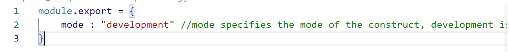
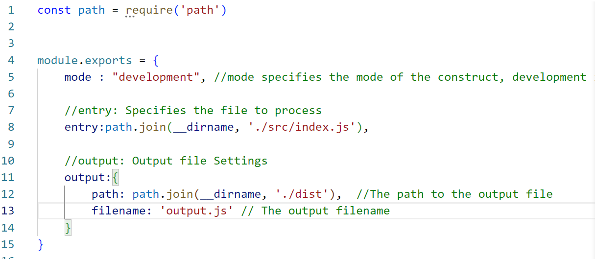

# In my homework, I focused on learning the Vue2.0 framework, which also includes front-end engineering applications (Webpack)
# What to learn:
1. Related concepts of front-end engineering
2. Common usage of Webpack
3. Package release
4. Source Map
5. Basic usage steps of Vue
6. Commands commonly used in Vue
7. Vue-devtools debugging tool
8. Filters and Listeners
9. Computed property usage
10. Basic usage of axios
11. vue-cli installation and use
12. Registration and use of components
13. Component props custom attributes
14. Resolve component style conflicts
15. Component life cycle
16. Communication between components (data sharing)
17. Use ref to refer to DOM elements and component instances
18. Basic use of $nextTick
19. Use of dynamic components
20. Use of slots (default slots, named slots, scoped slots)
21. Custom directives
22. Use of Eslint
23. Basic configuration and use of Vue-router
24. Routing Redirection
25. Nested routing, dynamic routing
26. Programmatic navigation, routed navigation guard

---
## 1. Related concepts of front-end engineering:
1. Front-end engineering refers to standardizing and standardizing the tools, technologies, processes, and experience required for front-end development in the development of front-end projects in enterprises and actual jobs.

2. Both the React front-end framework and the Vue front-end framework are based on front-end engineering.

3. Advantages: Front-end development is self-contained, with a set of standard development plans and processes.

4. Solution: Webpack

# 2. Common uses of Webpack:
1. Basic concept: Webpack is a specific solution for front-end project engineering.
2. Main functions: It provides friendly front-end modular development support, as well as powerful functions such as code compression and obfuscation, processing browser-side JavaScript compatibility, and performance optimization.
3. At present, front-end projects such as Vue and React are basically developed based on Webpack.
4. Create a list of alternate rows with different background colors (example):
    1. Create a new blank directory (folder) and run the npm init -y command to initialize the package management configuration file package.json
     
    2. Create a new src folder (src source code directory)
    3. Create a new src -> index.html home page and src -> index.js script file
    4. Initialize the basic structure of the homepage. When initializing the list in index.html, we can quickly generate ul: ul>li{ $ list} * 9 .
    5. Run the npm install jquery -s command to install JQuery
     
    
5. Webpack Configuration - Install Webpack in your project:
    1. Run the following command on the terminal to install two packages related to Webpack:
       ```
       npm install webpack@5.42.1 webpack-cli@4.7.2 -D
       ```
       
    2. Configure Webpack in the project. In the project root directory, create a webpack configuration file named webpack.config.js and initialize the following basic configuration:
       
    3. Under the scripts node of package.json, add the dev script as follows:
       
    4. Type npm run dev in the terminal.
        * Note: If the following errors occur:
        
        * We make the following changes in the package.json file:
        
    5. Modify the import file in index.html again.
        
    6. Run in VScode, right mouse button -> Open In Default Browser. We found that our effect can be achieved.
        * The role of the webpack.config.js file:
            * webpack.config.js is the webpack configuration file. Before webpack actually starts packaging and building, it will read this configuration file first, so as to package the project based on the given configuration.
            * Note: Since webpack is a packaging tool developed based on node.js, in its configuration file, it supports the use of node.js-related syntax and modules for personalized configuration of webpack.
    
6. In the webpack.config.js configuration file, specify the package entry through the entry node. Specify the output of the package through the output node.
    * The sample code is as follows:
    
    
    * After changing the output file, we need to change the imports in index.html accordingly. As follows:
    

* summary：
    1. In the above operation, I learned how to package and how to set the input and output files.
    2. However, some functions of the above operation cannot be realized. For example, we changed the background color of the list, and we need to re-run npm run dev for packaging.

7. Install the Webpack plugin:
    1.  webpack-dev-server: Similar to the nodemon tool used in the node.js stage, whenever the source code is modified, webpack will automatically package and build the project.
        1. Run the "npm install webpack-dev-server@3.11.2 -D" command in the terminal. As shown below:
            
        2. Modify the configuration in package.json, as shown in the following figure:
            
        3. After the configuration is complete, run npm run dev. If there is an error of Unable to load '@webpack-cli/serve' command, you need to update the version of Webpack. Run the command in the terminal: 
           ```
           npm install webpack-cli --save-dev
           ```
        5. After handling the error, run npm run dev again.
        6. After the above operations, Webpack performs real-time packaging.
        7. After running the above steps, we visit http://localhost:8080/ according to the output prompt.
        8. Display on the page, access src
            
        9. But after running, we found that the interface effect of index.html has not changed, because we access output.js in the dist directory. The packaged output output.js is placed in memory.
        10. We also need to modify the references in index.html, as shown in the figure below:
            
        11. After the above steps, I found that when accessing http://localhost:8080/, I need to manually access the src folder to access the main page.
    2.  html-webpack-plugin: An HTML plugin for webpack (similar to a templating engine plugin) that allows you to customize the contents of the index.html page.
        1. Install html-webpack-plugin:
           ```
           npm install html-webpack-plugin@5.3.2 -D
           ```
           
        2. Configure html-webpack-plugin:
           
           
    (3) devServer node:
        Modify the configuration in webpack.config.js, as shown in the following figure:
        
8. Loaders in webpack: webpack can't bundle non-JS files when it bundles, so we use loaders to bundle non-JS files.
    1. Bundle css files:
        * Install：
          ```
          npm i style-loader@3.0.0 css-loader@5.2.6 -D
          ```
        * Configure in webpack.config.js, as shown in the following figure:
            
        * I want to remove the dots in front of the list. I wrote a css file containing css styles, but because webpack cannot package non-js files when packaging, I configured the loader to package.
    2. Package the less file:
        * Install：
          ```
          npm i less-loader@10.0.1 less@4.1.1 -D
          ```
        * Configure in webpack.config.js, as shown in the following figure:
            
    3. Load images with webpack:
        * Installation: 
          ```
          npm i url-loader@4.1.1 file-loader@6.2.0 -D
          ```
        * Configure in webpack.config.js, as shown in the figure below:
            
        * I use a picture for testing, create an images folder under the css folder, add a picture in this folder, we name it head_portrait.jpg. Next, add  to index.html, and call the image in index.js.
    4. Packaging handles advanced syntax in js files:
        * Install babel-loader related packages: 
          ```
          npm i babel-loader@8.2.2 @babel/core@7.14.6 @babel/plugin-proposal-decorators@7.14.5 -D
          ```
        * Configure in webpack.config.js, as shown in the following figure:
            
        * In the project root directory, create a configuration file named babel.config.js, and define the configuration items of Babel as follows:
9.  Source Map in webpack:
     In the development environment, I should add the following configuration to webpack.config.js, so as to ensure that the number of lines of error reported at runtime is consistent with the number of lines of source code:
             