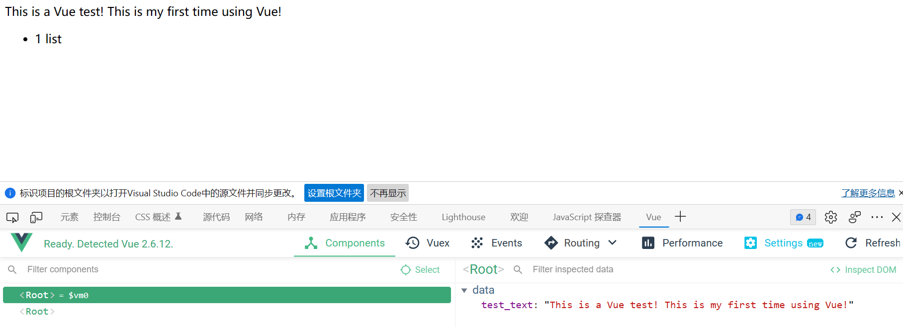

## Preparation: We need to install the vue_devtools_chrome_5.3.4.crx plugin on the browser. The specific operation is as follows:
1. Enter the browser, press the shortcut key alt+f, and select "Extensions", (select more tools -> extensions in chrome)
2. After entering, select "Developer Mode", find the provided vue_devtools_chrome_5.3.4.crx file, and drag it to the browser.
3. After the plug-in is completed, click "Details" under the plug-in, and select "Allow access to file URL" to open after entering.
* This is for preparation for later study.

## Outline:
1. Introduction to vue
2. Basic use of vue
3. Debugging tool for vue
4. Vue directives and filters

1. Introduction to vue:
    1. The official concept: Vue is a set of front-end frameworks for building user interfaces.
        * Build the user interface:
            + It is very convenient and quick to use vue to fill data in html pages.
        * Frame:
            + The framework means that there is a set of ready-made solutions, and programmers can only abide by the specifications of the framework.
            + Vue instructions, components (using the UI structure), routing, Vuex, Vue component library.
    2. Features: The features of the Vue framework are mainly reflected in the following two aspects:
        * Data Driven View:
             In a page that uses vue, vue will monitor data changes and automatically re-render the structure of the page.
             The data that the page depends on - (change) -> Vue monitors data changes - (automatic rendering) -> page structure
        * Two-way data binding:
            + When filling out the form, two-way data binding can assist developers to automatically synchronize the content filled by the user to the data source without manipulating the DOM
            + In the webpage, the form form is responsible for collecting data, and Ajax is responsible for submitting data, and the change of js data will be automatically rendered to the page; when the data collected by the form on the page changes, it will be automatically obtained by vue, and Update to js data.
    3. Simply understand the underlying principles of Vue:
        * MVVM:
            MVVM is the core of vue, which implements data-driven views and two-way data binding. MVVM refers to the three parts of Model, View and ViewModel, and it splits each HTML page into these three parts.
            + Model: The data source that the current page depends on when rendering.
            + View: The DOM structure rendered by the current page.
            + ViewModel: an instance of vue, which is the core of MVVM
2. Basic use of vue:
    1. Basic usage steps:
        * Import the script script file of vue.js, this file is in the example03_Vue_01 folder -> lib folder
        * Declare a DOM area in the page that will be controlled by vue
        * Create vm instance object (vue instance object)
    2. I simply used Vue in the Vue_test1.html file.
    3. And I can use the vue-devtools tool to view the code on the browser and change the data. As shown below:
        
3. Vue directives and filters:
    1. The concept of instructions: Directives (Directives) are template syntax provided by Vue for developers to assist developers in rendering the basic structure of the page.
    2. Instructions can be divided into the following 6 categories according to different purposes:
        1. Content rendering instructions:
            * The function of the content rendering instruction is to assist developers in rendering the text content of DOM elements
            * There are three commonly used content rendering instructions:
                + v-text: This command has disadvantages, it will overwrite the original content inside the element, the sample code is v-text.html.
                + {{ }}: The {{ }} syntax provided by vue is an interpolation expression, which is used most in actual project development and is specially used to solve the problem that v-text will overwrite the default text content. The sample code is Mustache.html and Vue-test2.html
                + v-html: The function of this instruction is to render the tagged string into real HTML content. The sample code is v-html.html, and Vue is simply used in the file.
        2. Attribute binding instructions:
             Because the interpolation expression can only be used in the content node of the element, and cannot be used in the attribute node of the element.
            * In vue, you can use the `v-bind:` directive to dynamically bind values to the attributes of the element; the abbreviation is `:` in English
            * When binding with the v-bind attribute, if dynamic splicing is required, the string should be wrapped in single quotes, such as the following sample code:
                `<div :title="'box' + index">this is a test</div>`
            Sample code：v-bind.html
            * Note: Javascript expressions can be used
        3. Event binding instructions:
            * vue provides v-on event binding instructions to assist programmers in binding event listeners for DOM elements.
            * v-on can be abbreviated as: @ symbol
            * Syntax format:
                ```
                <button @click="example"></button>
                methods: {
                    example() {
   			                // If you want to modify the data in data in the method, you can access it through this
   			                this.count += 1
                          }
                         }
                ```
            * `$event`: The application scenario of `$event`: If the default event object e is overwritten, you can manually pass an $event. 
                + Sample code: v-on$event.html
            * Note: After onclick, oninput, onkeyup, etc. in the native DOM object are replaced with the event binding form of vue,
                + The forms are:v-on:click、v-on:input、v-on:keyup;
                + Can also be shorthand: @click、@input、@keyup
            Sample code: v-on.html
            * Event modifiers: Calling event.preventDefault() or event.stopPropagation() in event handlers is a very common requirement. Therefore, vue provides event modifiers to assist programmers to control the triggering of events more conveniently. The five commonly used event modifiers are as follows:
                + .prevent: Prevent the default behavior (for example: prevent the jump of a connection, prevent the submission of the form, etc.)
                + .stop: prevent event bubbling
                + .capture: trigger the current event handler in capture mode
                + .once: The bound event is only triggered once
                + .self: Only trigger the event handler when event.target is the current element itself
                + Sample code: Event_modifiers.html
            * Key modifiers:
                + Press Esc: Clear.
                + Press Enter: prints enter in the text box.
                + Sample code: Key_modifier.html
        4. Two-way binding instructions
            * Vue provides the v-model instruction for two-way data binding, which can assist developers to quickly obtain form data without manipulating the DOM.
            * Only form elements can use v-model:
                + input
                + textarea
                +  select
            * Sample code: v-model.html
            * Modifiers for v-modle:
                 + .number: Automatically convert the user input value to a numeric type
                 + .trim: Automatically filter the leading and trailing blank characters entered by the user
                 + .lazy: update on "change" instead of "input"
                 + Sample code: v-model-modifier.html
        5. Conditional rendering instructions
            * v-if: The command will dynamically create or remove DOM elements, so as to realize the display and hiding of elements on the page;
                + Sample code: v-if-else.html
            * v-show: The command will dynamically add or remove the style="display: none;" style for the element, so as to realize the display and hiding of the element
            * Sample code: v-if-v-show.html
        6. List rendering instructions
            * v-for: Used to assist developers to render a list structure in a loop based on an array.
            * The v-for directive also supports an optional second parameter, the index of the current item. The format is: (item, index) in items
            * Use the key to maintain the state of the list:
                + So that Vue can track the identity of each node, so as to ensure that the stateful list is updated correctly, and improve the performance of rendering. At this point, you need to provide a unique key attribute for each item.
                + Notes on + key:
                    * The value of the key can only be a string or a number, and the value of the key must be unique (ie: the value of the key cannot be repeated)
                    * It is recommended to use the value of the id attribute of the data item as the value of the key (because the value of the id attribute is unique)
                    * It does not make sense to use the value of index as the value of key (because the value of index is not unique)
                    * It is recommended to specify the value of the key when using the v-for command (not only improves performance, but also prevents the state of the list from being disordered
                + label's for attribute: We can also use v-for in label.
            * Sample code: v-for.html
        7. Filter: It can be used in Vue2, but there is no filter in Vue3. Here is a simple study.
            * Filters are often used for text formatting. It can be used in two places: interpolation expressions and v-bind attribute bindings.
            * Filters should be added at the end of JavaScript expressions, invoked by the "pipe character"
                + Sample code: v-Filters.html
            * Private and global filters included in the sample code.
            * A private filter is a filter defined under the filters node, because it can only be used in the el area controlled by the current vm instance.
            * If you want to share filters between multiple vue instances, you can define global filters in the following format:
                ```
                Vue.filter('test_value', function (str) {
                    const first = str.charAt(0).toUpperCase()
                    const other = str.slice(1)
                    return first + other + '~~~'
                })
                ```