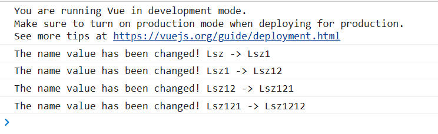

# Outline:
1. Listener
2. Computed properties
---

1. listener:
    1. The watch listener allows developers to monitor data changes and perform specific operations on data changes.
     
     Sample code: v_watch.html
     2. immediate option: By default, the component will not call the watch listener after the initial load. If you want the watch listener to be called immediately, you need to use the immediate option
     
     Sample code: v_watch_immediate.html
     3. Deep option: You can monitor the change of the attribute value in the object.
     
     Sample code: v_watch_deep.html

2. Computed property:
    1. concept: After a series of operations, an attribute value is finally obtained.
    2. features:
        1. It is defined as a method when it is declared, but it is essentially an attribute.
        2. Only when the data that the calculation attribute depends on changes, the calculation will be recalculated.
        sample code：v_computed.html