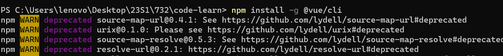
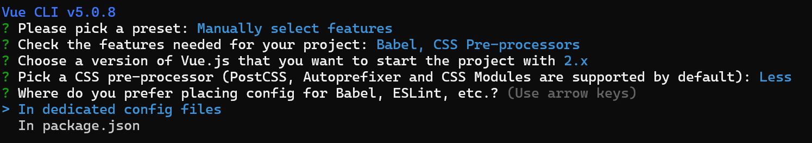

# Outline:
1. vue-cli
2. vue components
---

1. vue-cli：
    1. Single Page Application:
         The abbreviation SPA, as the name suggests, refers to a Web site with only one HTML page, and all functions and interactions are completed in this one and only page.
    2. The concept of vue-cli:
         vue-cli is the standard tool for Vue.js development. It simplifies the process for programmers to create engineered Vue projects based on webpack.
         * Official website: https://cli.vuejs.org/zh/
    3. Installation and use:
        1. Run the "npm install -g @vue/cli" command line in the terminal to install Vue-cli
            
        2. Run "vue create Name of the project" in the terminal under the folder we want to create.
            * If an error is reported in this part, first run the "cmd vue -V" command line.
            
        3. Select the last item in the options "Manually select features"
            
        4. Select the function to be installed, where * means it has been selected.
            
            * After selection:
            
        5. Select the version:
            
        6. Pick a CSS pre-processor:
            
        7. The location of the configuration files:
            
        8. Keep a record of the selected options so you can use them next time:
            
        9. Initialize vue-cli:
            
        10. Follow the prompts in two steps:
            ```  
            cd vue_test
            ```
            ```  
            npm run serve
            ```
            
    4. The vue_first in example06_Vue_04 is the Vue project I created. Based on this project, I have a preliminary understanding and try of Vue.
    5. The composition of the src directory:
         1. assets folder: store static resource files used in the project, such as: css style sheets and image resources
         2. Components folder: The reusable components packaged by programmers must be placed in the components directory
         3. main.js is the entry file of the project. To run the entire project, you must first execute main.js
         4. App.vue is the root component of the project.
    6. Operation process:
         1. In the engineering project: render App.vue to the specified area of index.html through main.js.
         2. Among them: App.vue is used to write the template structure (UI) to be rendered
         3. An el area needs to be reserved in index.html
         4. The role of main.js is to render App.vue into the area reserved by index.html
    

2. vue component:
    1. I know that the App.vue component is used to render the page by default. I will try to create a new component named vue_test.Vue under src.
    2. Vue is a front-end framework that supports component-based development. The extension of the component is .vue. The above App.vue file is essentially a vue component.
    3. The three components of the assembly:
        * template: the template structure of the component
        * script: JavaScript behavior of the component
               + . Data: data node, data in the component must be a function, and cannot directly point to a data object.
               + .* Method: Declare a method method.
        * style: the style of the component
        * Note: Each component must contain the template template structure, the other two are optional.
    4. Three steps to use the component:
        1. Create the components we need under src -> components
        2. In App.vue, use the import syntax to import the required components
        3. Use the components node to register components (registered private components)
        4. Use the component just registered as a tag
        5. Register the global component:
            * In the main.js entry file, through the Vue.component() method, global components can be registered
            * Ready to use after creation
    5. Component props:
        1. props is a custom attribute of a component. When encapsulating a common component,
        2. Using props can improve the reusability of components
        3. props are read-only, if you modify the value of props, an error will be reported
        4. If you want to modify the value of props, transfer the value of props to data
        5. default Default value: Define the default value of the attribute
        6. type value type: defines the value type of the attribute
        7. required required item: Set the attribute as a required item, forcing the user to pass the value of the attribute.
    6. The scoped attribute of the style node:
        1. Prevent style conflicts between components, because the style nodes in the .vue file are global.
        2. `<style scoped>`
    7. /deep/ style penetration:
        1. Above we added the scoped attribute to the style node, so the current component's style does not take effect on its subcomponents. But you can use the /deep/ depth selector to make the style effective for some self-child nodes
        2. `<style lang="less" scoped>`
---
# vue_first

## Project setup
```
npm install
```

### Compiles and hot-reloads for development
```
npm run serve
```

### Compiles and minifies for production
```
npm run build
```

### Customize configuration
See [Configuration Reference](https://cli.vuejs.org/config/).
