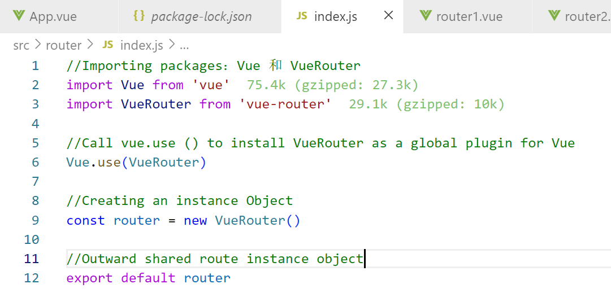
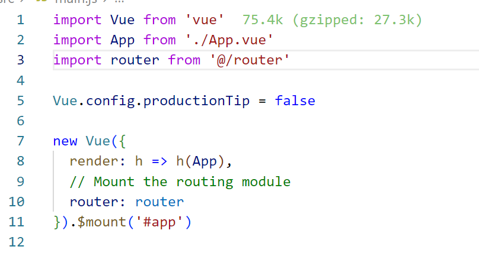

## Outline:
1. The concept and principle of front-end routing
2. Basic use of vue-router
3. Common usage of vue-router
4. Navigation
---

1. The concept and principle of front-end routing:
    1. Concept: It is the corresponding relationship
    2. There is only one HTML page in the SPA project, so the switching between different functions depends on the front-end routing to complete
    3. The concept of front-end routing: the correspondence between Hash addresses and components.
    4. How front-end routing works:
        * The user clicked a route link on the page
        * Clicking the routing link caused the Hash value in the URL address bar to change
        * The front-end routing listens to the change of the Hash address
        * The front-end routing renders the components corresponding to the current Hash address in the browser

2. Basic use of vue-router:
    1. Introduction: vue-router is the official routing solution given by vue.js. It can only be used in conjunction with the vue project, and can easily manage and switch components in the SPA project.
    2. Official document address: https://router.vuejs.org/zh/
    3. Installation and configuration:
        * Install the vue-router package, start the terminal in the vue2 project and enter the following command line:
           ```
           npm i vue-router@3.5.2 -S
           ```
           + Note: I did not install the latest version here, because I am learning vue2, so I can install 3.5.2.
        * Create routing module
          In the src source code directory, create a new router/index.js routing module.
           
        * Import and mount the routing module
            In the src/main.js entry file, import and mount the routing module.
           
        * Declare routing links and placeholders
    (4) You can use router-link instead of a tag.

3. Common usage of vue-router:
    1. Route redirection: When a user accesses address A, the user is forced to jump to address B to display a specific component page. We can specify a new routing address through the redirect attribute in the routing rule
    2. Nested routing: Realize nested display of components through routing
        * The router_children1.vue component in the child folder is a subcomponent of the router3.vue component.
        * In the src/router/index.js routing module, use the children attribute to declare child routing rules.
    3. Dynamic route matching:
        * Concept: Define the variable part of the Hash address as a parameter item, thereby improving the reusability of routing rules.
        * Use the English colon (:) in vue-router to define the parameter items of the route.
        * In components rendered by dynamic routes, you can use this.$route.params object to access the dynamically matched parameter values
        * Simplify the form of obtaining route parameters, allowing props to be passed in routing rules.
        
4. Navigation:
    1. Declarative navigation: In the browser, click the link to realize the navigation method.
        * The above is declarative navigation, the code is in example10_Vue_08\vue_fourth.
    2. Do programmatic navigation: In the browser, the method of calling API methods to realize navigation.
        * I demonstrate programmatic navigation in example10_Vue_08\vue_fifth.
    3. Programmatic navigation API:
        * this.$router.push('hash address') -> Jump to the specified hash address and add a history record, in other words: we can go back.
        * this.$router.replace('hash address') -> Jump to the specified hash address and replace the current history.
        * this.$router.go(value n) -> implement navigation history forward and backward.
            + $router.back() -> Go back to previous page in history
            + $router.forward() -> forward to next page in history
    4. Navigation guards: Navigation guards can control the access rights of routes.
        * Global pre-guard: Every time a routing navigation jump occurs, the global pre-guard will be triggered. Therefore, in the global pre-guard, programmers can control the access rights of each route. Declared in index.js.
            + Three formal parameters:
            + to -> is the information object that will access the route.
            + from -> is the information object of the route to leave.
            + next -> is a function, calling next() means release, allowing this route navigation.
         * Sample code: index.js and App.vue.
        


---
# vue_fourth

## Project setup
```
npm install
```

### Compiles and hot-reloads for development
```
npm run serve
```

### Compiles and minifies for production
```
npm run build
```

### Customize configuration
See [Configuration Reference](https://cli.vuejs.org/config/).
